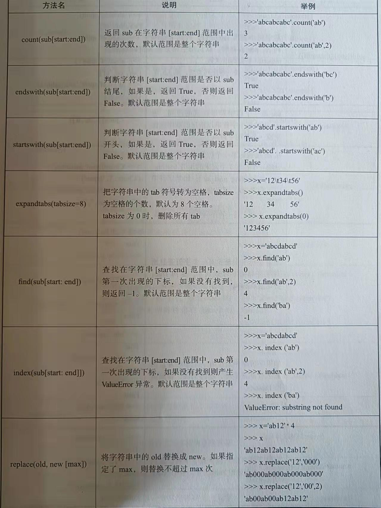

## 一.print的使用

>[代码参考](https://github.com/3114aaa/Python/blob/main/print.py)

格式查看

  print([obj1],[obj2]...[,sep=""][,"end=""][,file=sys.stdout])
  
  obj表示内容，sep用于替换obj与obj的逗号（逗号默认输出为空格），end结尾替换（print默认结尾会换行），file为打开文件对象(打开文件代码为'''变量名 = open("路径","w")''')
  

## 二.定义变量及其类型的识别

>[代码参考](https://github.com/3114aaa/Python/blob/main/%E5%8F%98%E9%87%8F%E7%B1%BB%E5%9E%8B.py)

python中定义变量格式: 变量名 = 值 （python会自动识别变量名)

进阶学习

  函数:type()可以识别变量类型，见代码参考中

## 三.if语句，input函数的学习

>[代码参考](https://github.com/3114aaa/Python/blob/main/if%E7%9A%84%E4%BD%BF%E7%94%A8.py)

python if语句和VB一样

格式查看

  <b>第一种使用</b>

    if 条件判断：
      执行代码
  
  <b>第二种使用</b>
  
    if 条件判断：
      执行代码A
    else:
      执行代码B
    
  <b>第三种使用</b>
  
    if 条件A判断：
      执行代码A
    elif 条件B判断:
      执行代码B
    ...
    else:
      执行代码B
  <b>比较符</b>
  |符号|作用
  |----|----
  | <  | 小于
  | >  | 大于
  | => | 大于等于
  | <= | 小于等于
  | == | 等于
  | != | 不等于
  | not| 取反
  | and| 和
  | or | 或
       
  <b><i>相信能看我写博客的人都学过VB，与VB知识差不多的就不过多叙述了</i></b>
  

ps:参考代码中有输入代码input,用于用户输入内容，不管用户输入什么都为字符串，例如用户输入123，
python会默认"123",因此eval()函数是将字符串变为可以在python中运行的代码(简单理解将最外边的双引号或引号去了)，例如eval("123")等于123，eval("1+2")等于3（因为去了引号后为1+2，不是字符串，于是python就开始运算了） 

## 四.格式化输出format()函数

>[代码参考](https://github.com/3114aaa/Python/blob/main/%E6%A0%BC%E5%BC%8F%E5%8C%96%E8%BE%93%E5%87%BAformat().py)
>没有固定格式，具体看代码

和format功能类似
  
|符号   |作用     |
|-------|---------|
|%d %i  |整型     |
|%o     |八进制   |
|%x %X  |十六进制 |
|%e     |科学计数e|
|%E     |科学计数E|
|%f     |小数     |
|%c     |asc码    |
|%s     |字符串   |
    
用法(例如输出整型)：print("年龄:%d"%(18))
  
  输出结果：年龄:18
  
  ps:可以试着写写
   
## 五.关于数值型
  ### （1）二、八、十六进制转十进制
  >[代码参考](https://github.com/3114aaa/Python/edit/main/%E6%95%B0%E5%80%BC%E5%9E%8B%E7%9A%84%E4%B8%80%E4%BA%9B%E7%9F%A5%E8%AF%86.py)
  
  见代码，没啥可以讲的
  
  ### （2）数值的运算符
  |符号|作用|符号|作用
  |----|----|----|----
  |  + | 加 | << | 移位
  |  - | 减 | >> |移位
  |  * | 乘 |  & |按位与
  |  / | 除 |  \||按位或
  | // |整除| %  | 取余
  | ** | 幂 | = |  赋值
  
  ### （3）数值的函数
  |函数名 |  作用  |函数名  |  作用
  |-------|-------|--------|------
  |abs()  |绝对值 |        |

## 六.转义字符及字符串
>[代码参考一(转义字符)](https://github.com/3114aaa/Python/blob/main/%E8%BD%AC%E4%B9%89%E5%AD%97%E7%AC%A6.py)

>[代码参考二(字符串)](https://github.com/3114aaa/Python/blob/main/%E8%BD%AC%E4%B9%89%E5%AD%97%E7%AC%A6%2B1.py)
  
  |转义字符 |  print输出为 
  |--------|-------
  |   \n   |换行
  |   \t   |tab
  |\\\\    | \
  | \\'    |'
  | \\"    |"
  |\0      |空格
  |\ooo    |八进制表示的acs
  |\xhh    |十六进制表示acs
  
  字符串的使用见代码参考二
  
  字符串函数
  
  
  
  
  
  
  
  
  
  偷个懒，直接放图片了
  
  ## 七.list列表类型
  >[代码参考一](https://github.com/3114aaa/Python/blob/main/%E6%95%B0%E7%BB%84.py)
  
  >[代码参考二](https://github.com/3114aaa/Python/blob/main/list2.py)
  
  python的数组创建方式很多，可以点击“代码参考一”了解具体情况
  
  

代码参考输出结果

      输出结果
  
      a []

      a [1]

      b [1, 2, 3]

      c [1, 'b', 3]

      d [1, [1, 2], '12']

      d 12

      d 1

      e ['a', 'b', 'c', 'd', 'e', 'f']

      f [-1, 0, 1, 2, 3, 4, 5, 6, 7, 8, 9]

      g [1, 2, 3]

      h [0, 1, 2, 3, 4]

      i [5, 6, 7, 8, 9]
    
  

  
**list函数**

- 求长度  len([1,2,3])  >> 3
- list合并  [1,2]+[3,4] >> [1,2,3,4]
- 是否包含 1 in [1,2,3] >> True
- 分片    [1,2,3,4][1:] >> [2,3,4]
- 分片    [1,2,3,4][1:2] >> [2]
- 分片    [1,2,3,4][:2] >> [1,2]
- 分片    [1,2,3,4][::2] >> [2,4]
- 分片    [1,2,3,4][::-1] >> [4,3,2,1]
- 分片赋值  [1,2,3,4][1,3] = [1,7]>> [1,1,7,4]
- 删除成员 del [1,2,3,4,5][0]  >> [2,3,4,5]
- 删除成员 del [1,2,3,4,5][0:3]  >> [3,4,5]

**list内置方法**

append() 添加单个对象

extend() 添加多个对象

insert() 插入对象

remove() 删除特定值，有重复只删第一个，没有发现将会报错

pop()  按位置删除，不填值删除最后一个

clear() 删除所有对象

x = [1,2,3];y=x;print(y) >> [1,2,3] 复制列表，地址会相同

copy() 复制列表，只复制一层，地址不同

deepcopy() 复制列表，深层复制，地址不同

sort()  排列顺序

ps:可以通过函数id()来观察变量的地址
详细见代码查看二

## 八.元组
此内容、集合、字典在VB未涉及，可先学完python语法（if while for）后再学习

敬请期待...

## 九.集合
此内容、元组、字典在VB未涉及，可先学完python语法（if while for）后再学习

敬请期待...

## 十.字典
此内容、元组、字典在VB未涉及，可先学完python语法（if while for）后再学习

敬请期待...

## 十一.while语句
>[代码参考一](https://github.com/3114aaa/Python/blob/main/while.py)

简单介绍：while是一种循环语句，当条件为True时，会一直循环（可配合break，continue使用）
**while格式一

    while 条件判断:
      执行代码
      
ps:使用和VB一样，不过多介绍了

**while格式二

    while 条件判断:
      执行代码A
    else:
      执行代码B
      
ps:while循环完后再执行else后的代码，遇到break将不会执行

  
  

while的进阶使用(break,continue)

  <b>break(跳出循环)</b>
  
    i =0
    while i < 10:
      i+=1
      if i > 5:
        break
      print(i,end="")
  
<b>结果：</b>
  
`12345`
  
  <b>continue(结束当前循环，进入下一次循环)</b>
  
    i =0
    while i < 10:
      i += 1
      if i = 5:
        continue
      print(i,end="")
  
<b>结果：</b>
  
`12346789`
  
  

